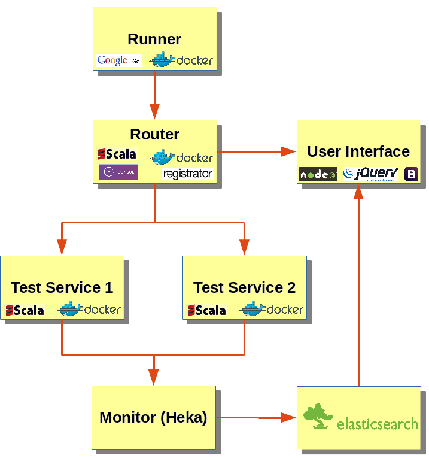

# Overview

* A canary is a bird. 

* Miners used to put canaries in "containers" and bring them down to the mine
  tunnels with them, if the birds died that indicated the presence of dangerous
  gases, and the miners would exit the mines immediately.  


* In the software industry canary testing is deploying a new version of an
  application to a small number of end users to make sure it works in a real
  world environment. If the new code is buggy the changes can be reversed
  quickly.

For the 2015 Hackathon of the our team decided to implement a canary testing
system with Docker containers and piecing together some existing software. In
the effort to build ship and run.

# Software diagram



# Software technologies used

### Runner
  * [Go](https://golang.org/)
  * [Docker](https://www.docker.com/)

### Router
  * [Scala](http://www.scala-lang.org/index.html)
  * [Consul](https://www.consul.io/)
  * [Registrator](https://github.com/gliderlabs/registrator)

### User Interface
  * [Node](https://nodejs.org/)
  * [jQuery](https://jquery.com/)
  * [Bootstrap](http://getbootstrap.com/)

### Test-services
  * [Docker](https://www.docker.com/)

### Monitor
* [Heka](http://hekad.readthedocs.org/en/v0.9.2/)
* [Elasticsearch](https://www.elastic.co/products/elasticsearch)

### Virtual Machines
* Deployed by Juju on Amazon

# Team

* [Whit Morriss](https://github.com/whitmo)
* [Wayne Witzel III](https://github.com/wwitzel3)
* [Kapil Thangavelu](https://github.com/kapilt)
* [Matt Bruzek](https://github.com/mbruzek)
* [Mike Ebinum](https://github.com/mebinum)
* [Mitch Ruebush](https://github.com/mruebush)
* [T.J. Corrigan](https://github.com/tj-corrigan)
* [Deep Mehta](https://github.com/deepmehtait)
* [Chad @tass6773](https://github.com/tass6773)
* [@n8foo](https://github.com/n8foo)

# Communication
The official IRC channel for the Hackathon project is `#systems-zoo` on the
chat.freenode.net server.

# How does it work?

### Runner
The runner is a simple docker container that generates HTTP GET traffic to the
router address and the router forward the traffic to one of the two services.

### [Test Services](https://github.com/system-zoo/test-service)

The two services are deployed to the production environment `test-service-1`
and`test-service-2`.  The `test-service-1` represents our stable released
service, and `test-service-2` represents the next version of the software. The
idea is to route some percentage of traffic to the new service.
[Registrator](https://github.com/gliderlabs/registrator) is used to register
the containers in Consul.

### [Router](https://github.com/system-zoo/router)
The `router` container is designed to handle the routing of traffic
between multiple revisions of the same service. Currently it is capable of
supporting a variety of continuous deployment techniques including:

  * Blue/Green deployments
  * Canary deployments
  * Mirroring of requests

It is written in Scala and pulling the configuration data form Consul.

### [User Interface](https://github.com/system-zoo/djui)
The User Interface communicates with the Consul key/value store to configure
the  percentage of traffic to route to the services.  The User Interface
displays the success rate and other valuable metrics of the containers.

### Monitoring
Each docker host is running [Heka](http://hekad.readthedocs.org/en/v0.9.2/)
agent to collect the success/failure metrics from the test-service logs, and
other container metrics.  These agents forward the data to the Heka hub.  The
Heka hub sends all the data to
[Elasticsearch](https://www.elastic.co/products/elasticsearch)
for storage.

# What does it measure?
The test-services are basic services which can be used for simulating a
service at different error/fail rates with variable amounts of latency.

# Technical Details

The following section is the details of the information sent between services.

## Payload for elasticsearch

### The test-service container response payload

```json
{
 "containerid": "0b0c75dc3a5e",
 "requestdate": "2015-06-21",
 "requesttime": "01:56:59",
 "containername": "hopeful_stallman",
 "response": {
    "request": 126,
    "duration": 2500,
    "response": 126,
    "code": 500
 }
```

#### Docker machine metrics

```json
{
   "0b0c75dc3a5e9849954be2d18a32481e95874af325cc3b16cd389e5d8a0a7e9f": {
      "newtork_in": "172.17.0.12",
      "containername": "hopeful_stallman",
      "ip": "172.17.0.12",
      "cpu_user": 9.42,
      "cpu_system": 1.39,
      "status": "172.17.0.12",
      "memory": "164777984",
      "cpu_all": 10.81,
      "newtork_out": "172.17.0.12"
   },
   "58a94dafc6c505df9b1eb6b6184f46b2c8f63b71202e301bc029103f8d253c34": {
      "newtork_in": "172.17.0.18",
      "containername": "sharp_elion",
      "ip": "172.17.0.18",
      "cpu_user": 3.23,
      "cpu_system": 0.54,
      "status": "172.17.0.18",
      "memory": "154255360",
      "cpu_all": 3.77,
      "newtork_out": "172.17.0.18"
   },
   "0d35e265adbfc2db737f8e142398a0e91634f5387d42c73833b9cfbdab4367bf": {
      "newtork_in": "172.17.0.14",
      "containername": "tender_fermat",
      "ip": "172.17.0.14",
      "cpu_user": 0.36,
      "cpu_system": 0.28,
      "status": "172.17.0.14",
      "memory": "856064",
      "cpu_all": 0.64,
      "newtork_out": "172.17.0.14"
   },
   "50f9a1e1b035f8c21684ea418d89b48e99b88a523ad7b23c9cd762131758c290": {
      "newtork_in": "172.17.0.3",
      "containername": "mynginx1",
      "ip": "172.17.0.3",
      "cpu_user": 0.01,
      "cpu_system": 0.01,
      "status": "172.17.0.3",
      "memory": "1388544",
      "cpu_all": 0.02,
      "newtork_out": "172.17.0.3"
   }
}
```

#### Route information to consul
```json
{
  "mirrorMode": false,
  "revisions": [
  {
    "revision": 1,
    "trafficRatio":0.9,
    "primary": true
  },
  {
    "revision": 2,
    "trafficRatio":0.1,
    "primary": false
  }
  ]
}
```
